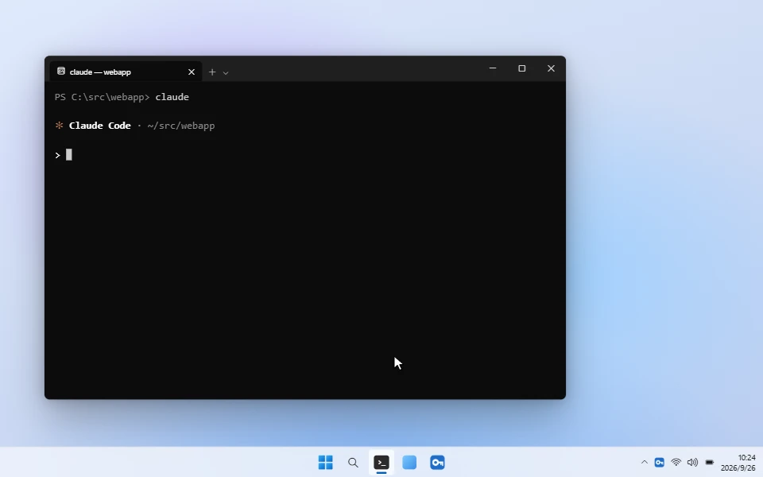
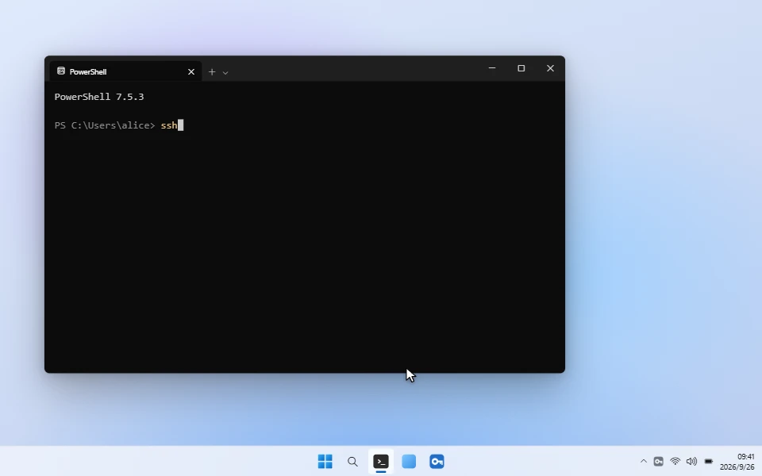
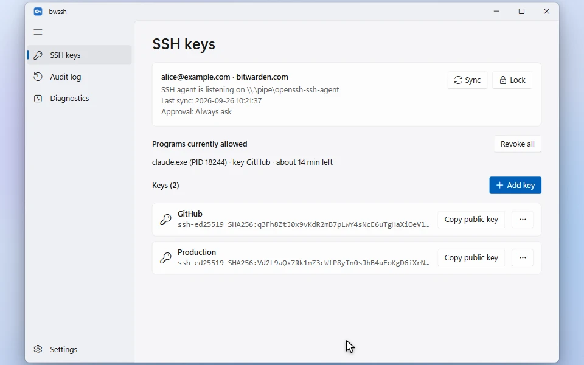
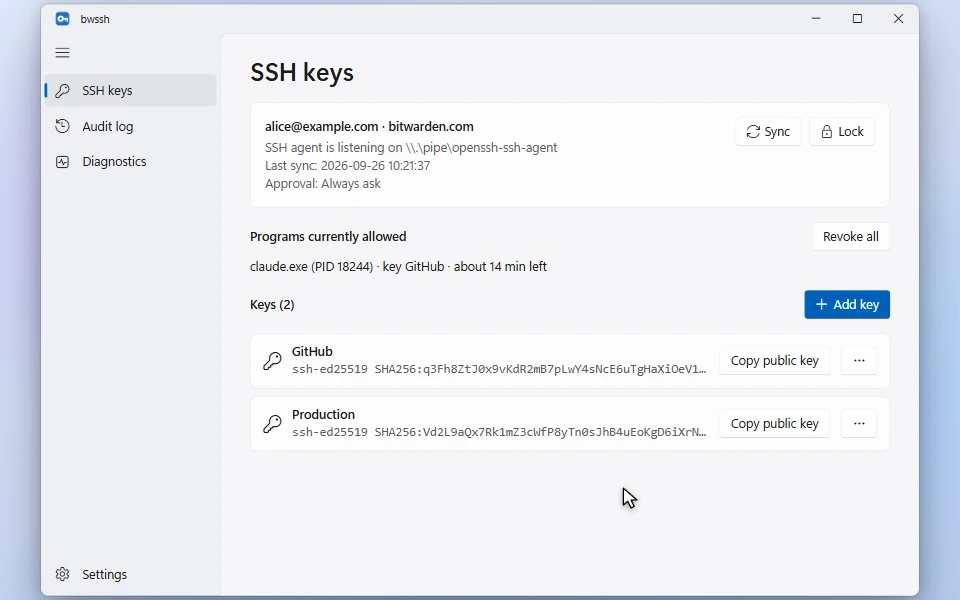

# bwssh

[中文](README.md)

bwssh is a native Windows (WinUI 3) SSH agent. It reads SSH keys from your Bitwarden vault and serves them to `ssh`, `git`, and AI agents such as Claude Code.

It works with **official Bitwarden accounts** (bitwarden.com / bitwarden.eu) and with accounts on **self-hosted servers**.

**Promo video** (1:25, with sound; on-screen text in Chinese):

https://github.com/user-attachments/assets/364c4304-048a-4365-b49c-174211e559ef



## Features

- **SSH agent**: listens on `\\.\pipe\openssh-ssh-agent`, so the built-in Windows OpenSSH tools (`ssh`, `scp`, `sftp`, `ssh-add`, `ssh-keygen`) work out of the box. Supports Ed25519, RSA, and ECDSA (P-256/384/521) keys, plus Git SSH commit signing.
- **Native notification approvals**: when a program uses a key, a Windows notification appears in the bottom-right corner. It shows the process chain (for example `claude.exe → bash.exe → git.exe → ssh.exe`), the destination host, and the key name, and you can approve or deny right there.
- **Three approval modes**
  - Always ask
  - Remember until lock: ask once per key and host
  - Never ask: allow while the vault is unlocked
- **Time-limited approval per program**: choose "Allow 15 min" in the notification, and that program (for example, the current Claude Code session) can use the key without asking for 15 minutes. The duration is configurable.
- **Audit log**: records the time, process chain, destination, key, and result of every signing request.
- **Quick unlock**: Windows Hello and PIN. When a request arrives while the vault is locked, you can unlock with Windows Hello and approve directly from the notification.
- **Auto-lock and sync**: lock when idle, when Windows locks, or on sleep, and sync the vault on a schedule.
- **Key management**: generate new keys (Ed25519 / RSA), import existing private keys (OpenSSH, PKCS#8, PEM, including passphrase-protected ones), and rename keys or move them to the trash.
- **Start with Windows, or on demand**: run in the tray from sign-in, or skip autostart and let `ssh` and `git push` start bwssh when they need it (see [Start on demand](#start-on-demand-nothing-resident)).
- **English and Chinese UI**: follows the Windows display language.

## See it in action

### Unlock with Windows Hello from the notification



### Generate, import and manage keys



### Audit log



## Install

Download `bwssh-setup-x.y.z.exe` from [Releases](https://github.com/luoxiaoxin123/bwssh/releases) and run it. No administrator rights are needed.

Requirements: Windows 10 2004 (19041) or later, x64. The installer is not code-signed, so SmartScreen may warn on first run. Choose "More info → Run anyway".

## Getting started

1. Open bwssh and pick a server: bitwarden.com, bitwarden.eu, or a self-hosted server (enter its URL, e.g. `https://vault.example.com`). Then sign in with your email and master password. Two-step login (authenticator app, email, YubiKey OTP) and API key sign-in are supported.
2. Check that your terminal sees the keys:

   ```powershell
   ssh-add -L
   ```

3. If you use Git for Windows, make Git use the built-in Windows OpenSSH. The ssh bundled with Git for Windows cannot use Windows named pipes:

   ```powershell
   git config --global core.sshCommand "C:/Windows/System32/OpenSSH/ssh.exe"
   ```

4. From now on, `ssh`, `git push`, and `git commit -S` trigger an approval notification whenever they need a key.

The Diagnostics page checks the pipe, conflicting programs, and your Git configuration, and includes a one-click connection test.

## Using it with Claude Code and other agents

When an agent runs `git push`, `ssh`, and similar commands, you get the same approval notification. It shows which agent started the request, for example `claude.exe → bash.exe → git.exe → ssh.exe`.

- To let an agent run several git operations in a row, choose "Allow 15 min". That agent process can then use the key without asking. A different agent process, a different key, or locking the vault asks again.
- Allowed programs are listed on the SSH keys page, where you can revoke them at any time. The tray menu also has "Revoke all temporary approvals".
- Every request is written to the audit log.

## Start on demand (nothing resident)

Don't want bwssh to start with Windows, or to open it by hand first? On the Diagnostics page, under "Start on demand", click "Set up". From then on, when `ssh` or `git push` runs and bwssh isn't running, bwssh starts in the tray and the connection continues. No background process or service stays resident in the meantime.

"Set up" does two things:

- It adds a `Match exec` rule at the top of `~/.ssh/config`. Before every connection, ssh runs `bwssh.exe --ensure-agent`, which returns immediately if bwssh is running. Otherwise it starts bwssh and returns once the agent is ready. The previous file is backed up to `config.bwssh.bak`.
- It puts `ssh`, `scp`, `sftp`, and `ssh-add` scripts in `~/bin`. By default, Git Bash uses the ssh bundled with Git, which cannot reach Windows named pipes. These scripts make Git Bash use the Windows OpenSSH client instead. Only Git Bash puts `~/bin` on its PATH, so cmd and PowerShell are not affected. Existing files with the same names are left alone.

| Where `ssh` runs | Supported |
|---|---|
| cmd, PowerShell | ✅ |
| Git Bash (including the Claude Code Bash tool) | ✅ |
| `git push` / `git pull` in any terminal | ✅ (with `core.sshCommand` set as in step 3 of Getting started) |

- **Latency**: about 0.5 s extra when bwssh has to start, and about 0.1–0.2 s per connection when it is already running.
- **Memory**: the check process lives for about 0.1 s and uses about 9 MB of private memory, all of which is freed when it exits.
- **Limits**: `ssh-add` and Git SSH commit signing (`git commit -S`) don't read the ssh config, so they don't start bwssh.
- **Undo**: click "Undo" on the same card. Uninstalling bwssh also cleans this up.

## Notes

- **Pipe conflicts**: only one program can own `\\.\pipe\openssh-ssh-agent` at a time.
  - If the Windows OpenSSH Authentication Agent service is running, run this in an elevated PowerShell:

    ```powershell
    Stop-Service ssh-agent; Set-Service ssh-agent -StartupType Disabled
    ```

  - If the Bitwarden desktop app has its SSH agent turned on, turn it off in that app's settings.
  - Once the pipe is free, bwssh takes it over within 5 seconds.
- **Not supported**: SSO sign-in; Duo and WebAuthn two-step login; accounts that use the new COSE encryption format; PuTTY `.ppk` keys (export them to OpenSSH format with PuTTYgen first).

## Data and security

- Local data lives in `%LOCALAPPDATA%\BwSshAgent`.
  - Synced vault data stays encrypted and is additionally protected with Windows DPAPI, so only the current Windows user can read it.
  - Tokens, the public key list, and PIN settings are also protected with DPAPI.
- Private keys are decrypted only while the vault is unlocked, kept in memory, and zeroed on lock.
- Vault writes (create, rename, move to trash) are encrypted locally before upload. The server only receives ciphertext.
- The PIN protects the user key with an Argon2id-derived key. By default, you must unlock once with your master password or Windows Hello after each start before the PIN works. Five wrong PINs in a row remove the PIN.
- Windows Hello unlock has a Hello-protected key sign a fixed challenge, and derives the encryption key from that signature.
- The named pipe accepts connections from the current user only.

## Building from source

Requires the .NET 10 SDK. Building the installer also requires [Inno Setup 6](https://jrsoftware.org/isinfo.php).

```powershell
dotnet test --project tests/BwSshAgent.Core.Tests   # run the tests
./build.ps1 -Version 1.0.0                           # writes artifacts/installer/bwssh-setup-1.0.0.exe
```

The demo animations in this README come from [docs/demo](docs/demo): `stage.html` recreates the UI in HTML and drives it along a timeline, and `render.py` captures it frame by frame in Edge and encodes them as 60 fps animated WebP. After changing `stage.html`, run `python docs/demo/render.py` to regenerate them (requires `pip install playwright pillow numpy`).

When you publish a new GitHub Release, the [workflow](.github/workflows/release.yml) runs the tests, builds the installer, and attaches it to that release.

## License

[Apache License 2.0](LICENSE)
