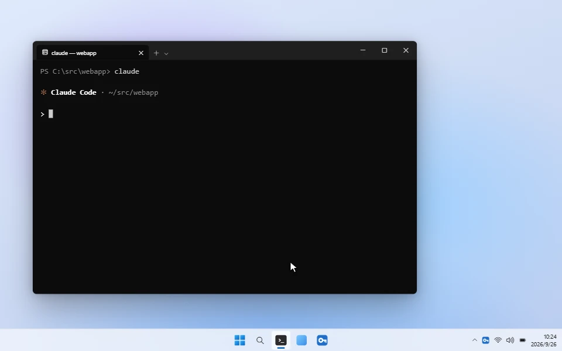
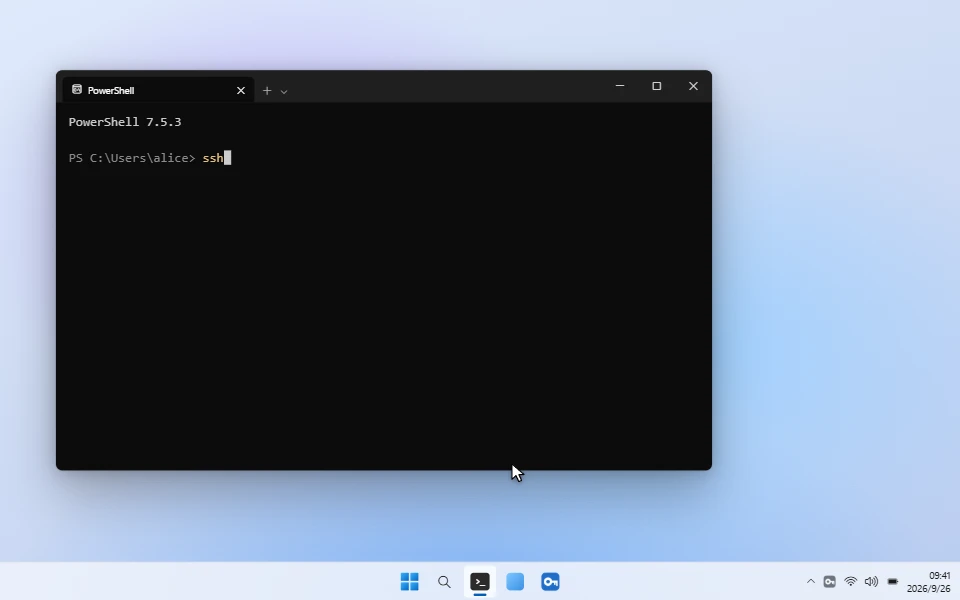
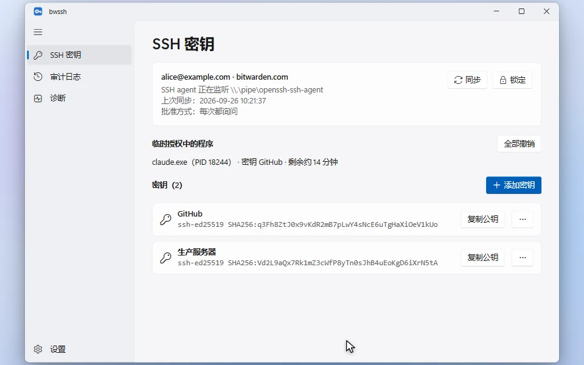
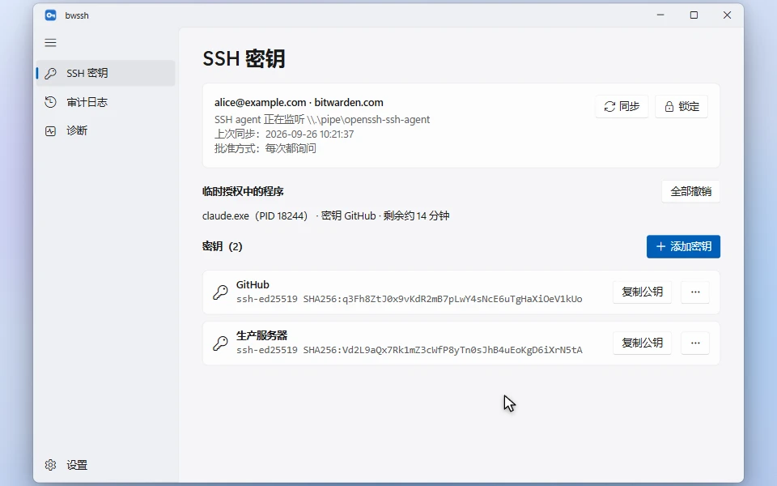

# bwssh

[English](README.en.md)

bwssh 是一个 Windows 原生（WinUI 3）的 SSH agent。它从 Bitwarden 密码库读取 SSH 密钥，给 `ssh`、`git` 以及 Claude Code 这类 AI Agent 使用。

支持 **Bitwarden 官方账号**（bitwarden.com / bitwarden.eu），也支持**自建服务器**上的账号。

**宣传片**（1 分 25 秒，有声音）：

https://github.com/user-attachments/assets/364c4304-048a-4365-b49c-174211e559ef



## 功能

- **SSH agent**：监听 `\\.\pipe\openssh-ssh-agent`，Windows 自带的 OpenSSH（`ssh`、`scp`、`sftp`、`ssh-add`、`ssh-keygen`）可以直接使用。支持 Ed25519、RSA、ECDSA（P-256/384/521）密钥，也支持 Git 的 SSH 提交签名。
- **原生通知审批**：程序使用密钥时，屏幕右下角会弹出 Windows 通知，显示发起的程序链（如 `claude.exe → bash.exe → git.exe → ssh.exe`）、目标主机和密钥名称，可以直接批准或拒绝。
- **三种批准方式**
  - 每次都询问
  - 锁定密码库前记住：同一把密钥、同一台主机只问一次
  - 从不询问：解锁状态下直接放行
- **按程序限时放行**：通知上点“15 分钟内放行”后，这个程序（比如当前这个 Claude Code 会话）在 15 分钟内使用这把密钥都不再询问。时长可以调整。
- **审计日志**：记录每次签名的时间、程序链、目标主机、密钥和结果。
- **快速解锁**：支持 Windows Hello 和 PIN。锁定状态下收到请求时，可以直接在通知里用 Windows Hello 解锁并批准。
- **自动锁定与同步**：可以在空闲、锁屏、睡眠时自动锁定，并定时同步密码库。
- **管理密钥**：可以生成新密钥（Ed25519 / RSA），导入已有私钥（OpenSSH、PKCS#8、PEM，支持带密码的私钥），也可以改名或移到回收站。
- **开机自启或按需启动**：可以开机自启、常驻托盘；也可以不自启，执行 `ssh`、`git push` 时自动把 bwssh 拉起来（见[按需启动](#按需启动不需要常驻后台)）。
- **中英文界面**：自动跟随系统语言。

## 演示

### 锁定时直接用 Windows Hello 解锁



### 生成、导入和管理密钥



### 审计日志



## 安装

在 [Releases](https://github.com/luoxiaoxin123/bwssh/releases) 页面下载 `bwssh-setup-x.y.z.exe` 并运行。安装不需要管理员权限。

系统要求：Windows 10 2004（19041）或更高版本，x64。安装包没有代码签名，首次运行时 SmartScreen 可能会提示，点“更多信息 → 仍要运行”即可。

## 快速开始

1. 打开 bwssh，选择服务器：bitwarden.com、bitwarden.eu 或自托管服务器（填入地址，例如 `https://vault.example.com`），然后用邮箱和主密码登录。也支持两步验证（验证器 App、邮件、YubiKey OTP）和 API Key 登录。
2. 确认终端能看到密钥：

   ```powershell
   ssh-add -L
   ```

3. 如果用 Git for Windows，让 Git 使用系统自带的 OpenSSH。Git for Windows 自带的 ssh 不支持 Windows 命名管道：

   ```powershell
   git config --global core.sshCommand "C:/Windows/System32/OpenSSH/ssh.exe"
   ```

4. 之后 `ssh`、`git push`、`git commit -S` 用到密钥时，右下角会弹出审批通知。

程序的“诊断”页可以检查管道状态、冲突程序和 Git 配置，还能一键测试。

## 在 Claude Code 等 Agent 中使用

Agent 执行 `git push`、`ssh` 等命令时，同样会触发审批通知。通知里会显示是哪个 Agent 发起的请求，比如 `claude.exe → bash.exe → git.exe → ssh.exe`。

- 让 Agent 连续执行几次 git 操作：点“15 分钟内放行”，这段时间内同一个 Agent 进程使用这把密钥时不再询问。换一个 Agent 进程、换一把密钥，或者锁定密码库之后，都会重新询问。
- 已授权的程序会显示在“SSH 密钥”页，可以随时撤销。托盘菜单里也有“撤销所有临时授权”。
- 所有请求都会记入“审计日志”。

## 按需启动（不需要常驻后台）

不想开机自启，也不想每次先手动打开 bwssh？在“诊断”页的“按需启动”里点“一键设置”。之后执行 `ssh`、`git push` 时，如果 bwssh 没有运行，会先在托盘中把它启动起来，再继续连接。平时没有任何常驻的后台进程或服务。

一键设置会做两件事：

- 在 `~/.ssh/config` 开头加入一段 `Match exec` 规则。ssh 每次连接前都会执行 `bwssh.exe --ensure-agent`：bwssh 已在运行就立即返回，没有运行就启动它，等 agent 就绪后再返回。修改前会把原文件备份为 `config.bwssh.bak`。
- 在 `~/bin` 中放入 `ssh`、`scp`、`sftp`、`ssh-add` 四个转发脚本。Git Bash 默认用的是 Git 自带的 ssh，它连不上 Windows 命名管道；有了这些脚本，Git Bash 会改用系统 OpenSSH。`~/bin` 只有 Git Bash 会加入 PATH，不影响 cmd 和 PowerShell。已有同名文件的不会覆盖。

| 在哪里执行 `ssh` | 是否支持 |
|---|---|
| cmd、PowerShell | ✅ |
| Git Bash（包括 Claude Code 的 Bash 工具） | ✅ |
| 任意终端里的 `git push` / `git pull` | ✅（需要按“快速开始”第 3 步设置 `core.sshCommand`） |

- **耗时**：bwssh 没有运行时，这次连接多等约 0.5 秒；已在运行时，每次连接多约 0.1～0.2 秒。
- **内存**：检查进程只存在约 0.1 秒，独占内存约 9 MB，结束后全部释放。
- **限制**：`ssh-add` 和 Git 的 SSH 提交签名（`git commit -S`）不读取 ssh 配置，不会自动启动 bwssh。
- **撤销**：在同一张卡片上点“撤销”即可。卸载 bwssh 时也会自动清理。

## 注意事项

- **管道冲突**：`\\.\pipe\openssh-ssh-agent` 同时只能被一个程序占用。
  - 如果 Windows 的 OpenSSH Authentication Agent 服务在运行，以管理员身份执行：

    ```powershell
    Stop-Service ssh-agent; Set-Service ssh-agent -StartupType Disabled
    ```

  - 如果 Bitwarden 桌面客户端开启了 SSH agent，请在它的设置中关闭。
  - 占用解除后，bwssh 会在 5 秒内自动接管。
- **不支持**：SSO 登录；Duo、WebAuthn 两步验证；使用新版 COSE 加密格式的账户；PuTTY `.ppk` 私钥（请先用 PuTTYgen 导出为 OpenSSH 格式）。

## 数据与安全

- 本地数据保存在 `%LOCALAPPDATA%\BwSshAgent`。
  - 同步下来的密码库数据保持加密状态，外层再用 Windows DPAPI 保护，只有当前 Windows 用户能读取。
  - 登录令牌、公钥列表和 PIN 设置同样用 DPAPI 保护。
- 私钥只在解锁状态下解密并保存在内存中，锁定时清零。
- 对密码库的写入（新建、改名、移到回收站）上传前全部在本地加密，服务器只收到密文。
- PIN 通过 Argon2id 派生密钥来保护用户密钥。默认要求每次启动后先用主密码或 Windows Hello 解锁一次，之后才能用 PIN；连续输错 5 次会清除 PIN。
- Windows Hello 解锁使用 Windows Hello 保护的密钥对固定挑战签名，再由签名派生加密密钥。
- 命名管道只允许当前用户连接。

## 从源码构建

需要 .NET 10 SDK。打包安装程序还需要 [Inno Setup 6](https://jrsoftware.org/isinfo.php)。

```powershell
dotnet test --project tests/BwSshAgent.Core.Tests   # 运行测试
./build.ps1 -Version 1.0.0                           # 输出 artifacts/installer/bwssh-setup-1.0.0.exe
```

README 里的演示动图由 [docs/demo](docs/demo) 生成：`stage.html` 用 HTML 复刻界面并按时间轴驱动画面，`render.py` 用 Edge 逐帧截图并编码成 60 fps 动态 WebP。修改 `stage.html` 后执行 `python docs/demo/render.py` 即可重新生成（需要 `pip install playwright pillow numpy`）。

在 GitHub 上发布新的 Release 时，[workflow](.github/workflows/release.yml) 会自动运行测试、构建安装包，并把安装包上传到这个 Release。

## 许可证

[Apache License 2.0](LICENSE)

## LINK
[Linux.do](https://linux.do/)
